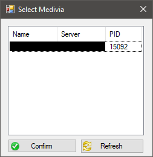

# MediviaHelper

Pequeña tool para Medivia.
Simplemente lee los estados del personaje en memoria y muestra una alerta tipo notificacion cuando se cumplen las condiciones.
Esta pensada para ser una tool no abusiva que no implique ninguna automatizacion o macro.

## Selector del cliente

## Helper

## Notificación

